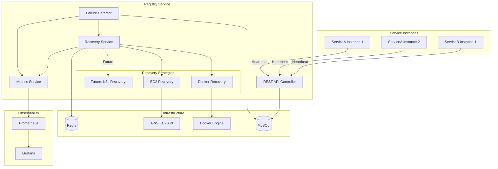
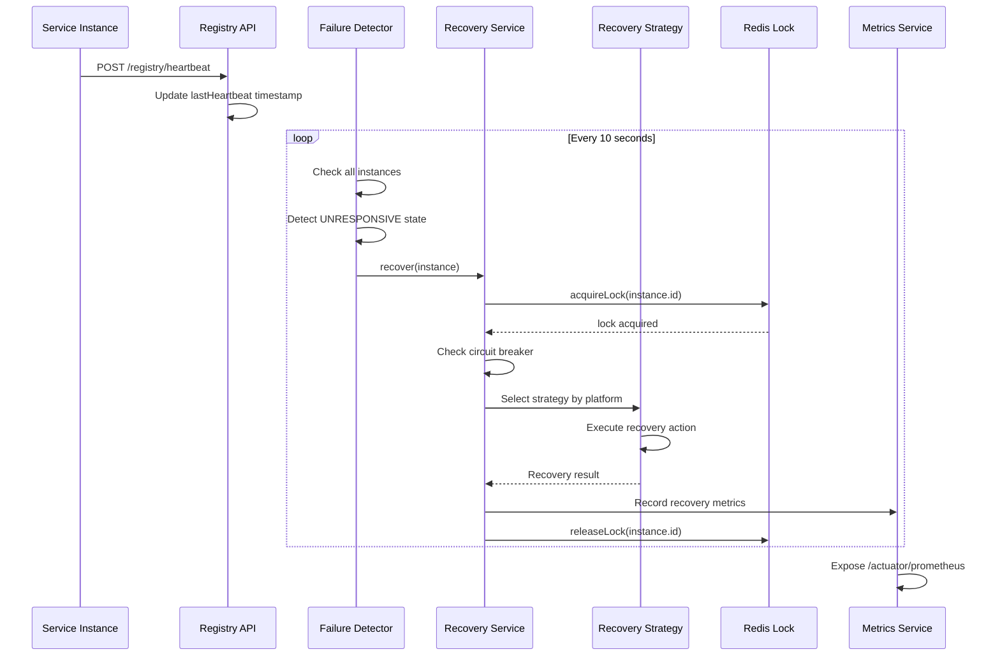

# Design Document: Registry Service Enhancements

## Overview

This design enhances the Sentinel Self-Healing Microservice Registry with AWS EC2 recovery capabilities, comprehensive observability through Prometheus/Grafana, multi-instance support, enhanced failure detection, and pluggable recovery strategies. The design maintains backward compatibility with existing Docker-based recovery while introducing a flexible architecture that supports future recovery platforms (Kubernetes, etc.).

The core enhancement is the introduction of a Strategy pattern for recovery mechanisms, allowing the Registry Service to manage both containerized and cloud-based microservices through a unified interface. Observability is achieved through Micrometer metrics integration, providing real-time insights into service health, recovery operations, and system performance.

## Architecture

### High-Level Architecture



### Component Interaction Flow



## Components and Interfaces

### 1. Recovery Strategy Interface

The core abstraction for pluggable recovery mechanisms:

```java
public interface RecoveryStrategy {
    /**
     * Get the platform name this strategy handles
     */
    String getPlatform();
    
    /**
     * Check if this strategy can recover the given instance
     */
    boolean canRecover(ServiceInstanceEntity instance);
    
    /**
     * Attempt to recover the instance
     * @return RecoveryResult containing success status and details
     */
    RecoveryResult recover(ServiceInstanceEntity instance);
    
    /**
     * Get available recovery actions for this platform
     */
    List<RecoveryAction> getAvailableActions();
}

public enum RecoveryAction {
    RESTART,    // Docker: restart container, EC2: reboot instance
    START,      // Docker: start container, EC2: start instance
    STOP,       // Docker: stop container, EC2: stop instance
    RECREATE    // Docker: remove and recreate, EC2: terminate and launch
}

public record RecoveryResult(
    boolean success,
    RecoveryAction actionTaken,
    String message,
    Exception error
) {}
```

### 2. EC2 Recovery Strategy Implementation

```java
@Service
@ConditionalOnProperty(name = "registry.recovery.ec2.enabled", havingValue = "true")
public class EC2RecoveryStrategy implements RecoveryStrategy {
    private final Ec2Client ec2Client;
    private final MeterRegistry meterRegistry;
    
    @Override
    public String getPlatform() {
        return "ec2";
    }
    
    @Override
    public boolean canRecover(ServiceInstanceEntity instance) {
        return "ec2".equals(instance.getService().getPlatform()) 
            && instance.getEc2InstanceId() != null;
    }
    
    @Override
    public RecoveryResult recover(ServiceInstanceEntity instance) {
        String instanceId = instance.getEc2InstanceId();
        
        try {
            // Get current instance state
            InstanceState state = getInstanceState(instanceId);
            RecoveryAction action = determineAction(state);
            
            switch (action) {
                case START -> startInstance(instanceId);
                case RESTART -> rebootInstance(instanceId);
                case STOP -> stopInstance(instanceId);
            }
            
            recordMetric("success", action);
            return new RecoveryResult(true, action, "EC2 recovery successful", null);
            
        } catch (Ec2Exception e) {
            recordMetric("failure", null);
            return new RecoveryResult(false, null, "EC2 recovery failed: " + e.awsErrorDetails().errorMessage(), e);
        }
    }
    
    private RecoveryAction determineAction(InstanceState state) {
        return switch (state) {
            case STOPPED, STOPPING -> RecoveryAction.START;
            case RUNNING -> RecoveryAction.RESTART;
            default -> RecoveryAction.RESTART;
        };
    }
}
```

### 3. Enhanced Recovery Service

```java
@Service
public class RecoveryService {
    private final List<RecoveryStrategy> strategies;
    private final CircuitBreakerRegistry circuitBreakerRegistry;
    private final ServiceInstanceRepository instanceRepository;
    private final RedisLockService lockService;
    private final RestartCounterService restartCounterService;
    private final RecoveryEventPublisher eventPublisher;
    private final RecoveryPolicyService policyService;
    
    public void recover(ServiceInstanceEntity instance) {
        String lockKey = "recovery:lock:" + instance.getId();
        String ownerId = UUID.randomUUID().toString();
        
        if (!lockService.acquireLock(lockKey, ownerId, 2000)) {
            return; // Another registry instance is handling this
        }
        
        try {
            // Check circuit breaker
            CircuitBreaker circuitBreaker = circuitBreakerRegistry.circuitBreaker(
                "recovery-" + instance.getId()
            );
            
            if (circuitBreaker.getState() == CircuitBreaker.State.OPEN) {
                quarantine(instance);
                return;
            }
            
            // Get recovery policy for this service type
            RecoveryPolicy policy = policyService.getPolicyForService(
                instance.getService().getName()
            );
            
            // Check restart attempts
            int attempts = restartCounterService.getCount(instance.getId());
            if (attempts >= policy.getMaxRestartAttempts()) {
                quarantine(instance);
                return;
            }
            
            // Select and execute recovery strategy
            RecoveryStrategy strategy = selectStrategy(instance);
            if (strategy == null) {
                eventPublisher.publishEvent(new RecoveryEvent(
                    instance, null, false, "No recovery strategy available"
                ));
                quarantine(instance);
                return;
            }
            
            RecoveryResult result = circuitBreaker.executeSupplier(
                () -> strategy.recover(instance)
            );
            
            if (result.success()) {
                instance.setLastRestartTimestamp(System.currentTimeMillis());
                restartCounterService.increment(instance.getId());
                instanceRepository.save(instance);
                
                eventPublisher.publishEvent(new RecoveryEvent(
                    instance, result.actionTaken(), true, result.message()
                ));
            } else {
                eventPublisher.publishEvent(new RecoveryEvent(
                    instance, result.actionTaken(), false, result.message()
                ));
            }
            
        } catch (Exception e) {
            eventPublisher.publishEvent(new RecoveryEvent(
                instance, null, false, "Recovery exception: " + e.getMessage()
            ));
        } finally {
            lockService.releaseLock(lockKey, ownerId);
        }
    }
    
    private RecoveryStrategy selectStrategy(ServiceInstanceEntity instance) {
        String platform = instance.getService().getPlatform();
        return strategies.stream()
            .filter(s -> s.getPlatform().equals(platform))
            .filter(s -> s.canRecover(instance))
            .findFirst()
            .orElse(null);
    }
}
```

### 4. Metrics Service

```java
@Service
public class MetricsService {
    private final MeterRegistry meterRegistry;
    private final ServiceInstanceRepository instanceRepository;
    
    @PostConstruct
    public void registerMetrics() {
        // Gauge for instances by state
        Gauge.builder("registry_instances_by_state", instanceRepository,
            repo -> repo.countByState(InstanceState.UP))
            .tag("state", "UP")
            .register(meterRegistry);
            
        Gauge.builder("registry_instances_by_state", instanceRepository,
            repo -> repo.countByState(InstanceState.SUSPECT))
            .tag("state", "SUSPECT")
            .register(meterRegistry);
            
        Gauge.builder("registry_instances_by_state", instanceRepository,
            repo -> repo.countByState(InstanceState.UNRESPONSIVE))
            .tag("state", "UNRESPONSIVE")
            .register(meterRegistry);
            
        Gauge.builder("registry_instances_by_state", instanceRepository,
            repo -> repo.countByState(InstanceState.QUARANTINED))
            .tag("state", "QUARANTINED")
            .register(meterRegistry);
    }
    
    public void recordHeartbeat(ServiceInstanceEntity instance, long latencyMs) {
        Timer.builder("registry_heartbeat_latency")
            .tag("service", instance.getService().getName())
            .register(meterRegistry)
            .record(latencyMs, TimeUnit.MILLISECONDS);
    }
    
    public void recordFailure(ServiceInstanceEntity instance) {
        Counter.builder("registry_failure_count_total")
            .tag("service", instance.getService().getName())
            .register(meterRegistry)
            .increment();
    }
    
    public void recordRecovery(ServiceInstanceEntity instance, RecoveryAction action, boolean success) {
        String metricName = success ? "registry_recovery_success_total" : "registry_recovery_failure_total";
        
        Counter.builder(metricName)
            .tag("service", instance.getService().getName())
            .tag("platform", instance.getService().getPlatform())
            .tag("action", action.name())
            .register(meterRegistry)
            .increment();
    }
    
    public void recordRestart(ServiceInstanceEntity instance) {
        Counter.builder("registry_restart_count_total")
            .tag("service", instance.getService().getName())
            .tag("platform", instance.getService().getPlatform())
            .register(meterRegistry)
            .increment();
    }
}
```

### 5. Enhanced Failure Detector

```java
@EnableScheduling
@Component
public class FailureDetector {
    private final ServiceInstanceRepository instanceRepository;
    private final RecoveryService recoveryService;
    private final MetricsService metricsService;
    private final HealthCheckService healthCheckService;
    
    private static final long DEFAULT_HEARTBEAT_THRESHOLD_MS = 30_000;
    private static final long GRACE_PERIOD_MS = 60_000;
    private static final int SUSPECT_THRESHOLD = 2;
    private static final int UNRESPONSIVE_THRESHOLD = 4;
    
    @Scheduled(fixedDelay = 10_000)
    public void detectFailures() {
        long now = System.currentTimeMillis();
        
        for (ServiceInstanceEntity instance : instanceRepository.findAll()) {
            // Skip instances in grace period
            if (isInGracePeriod(instance, now)) {
                continue;
            }
            
            long threshold = getHeartbeatThreshold(instance);
            long silence = now - instance.getLastHeartBeat();
            
            // Perform health check if configured
            boolean healthCheckPassed = performHealthCheck(instance);
            
            switch (instance.getState()) {
                case UP -> {
                    if (silence > threshold && !healthCheckPassed) {
                        instance.setMissedHeartBeats(1);
                        instance.setState(InstanceState.SUSPECT);
                        metricsService.recordFailure(instance);
                    }
                }
                
                case SUSPECT -> {
                    if (silence <= threshold || healthCheckPassed) {
                        instance.setMissedHeartBeats(0);
                        instance.setState(InstanceState.UP);
                    } else {
                        int missed = instance.getMissedHeartBeats() + 1;
                        instance.setMissedHeartBeats(missed);
                        if (missed >= UNRESPONSIVE_THRESHOLD) {
                            instance.setState(InstanceState.UNRESPONSIVE);
                        }
                    }
                }
                
                case UNRESPONSIVE -> {
                    if (silence <= threshold || healthCheckPassed) {
                        instance.setMissedHeartBeats(0);
                        instance.setState(InstanceState.UP);
                    } else if (canAttemptRecovery(instance, now)) {
                        recoveryService.recover(instance);
                    }
                }
                
                case QUARANTINED -> {
                    if (instance.getQuarantineUntilTimestamp() != null 
                        && now >= instance.getQuarantineUntilTimestamp()) {
                        instance.setState(InstanceState.UNRESPONSIVE);
                    }
                }
            }
            
            instanceRepository.save(instance);
        }
    }
    
    private boolean isInGracePeriod(ServiceInstanceEntity instance, long now) {
        // Instances registered within the last 60 seconds get a grace period
        return instance.getCreatedAt() != null 
            && (now - instance.getCreatedAt().getTime()) < GRACE_PERIOD_MS;
    }
    
    private long getHeartbeatThreshold(ServiceInstanceEntity instance) {
        Long customThreshold = instance.getService().getHeartbeatThresholdMs();
        return customThreshold != null ? customThreshold : DEFAULT_HEARTBEAT_THRESHOLD_MS;
    }
    
    private boolean performHealthCheck(ServiceInstanceEntity instance) {
        if (instance.getHealthPath() == null || instance.getHealthPath().isEmpty()) {
            return false; // No health check configured, rely on heartbeat only
        }
        
        return healthCheckService.check(instance);
    }
}
```

### 6. Health Check Service

```java
@Service
public class HealthCheckService {
    private final RestTemplate restTemplate;
    private final CircuitBreakerRegistry circuitBreakerRegistry;
    
    public HealthCheckService() {
        this.restTemplate = new RestTemplate();
        // Configure timeouts
        HttpComponentsClientHttpRequestFactory factory = new HttpComponentsClientHttpRequestFactory();
        factory.setConnectTimeout(2000);
        factory.setReadTimeout(3000);
        this.restTemplate.setRequestFactory(factory);
    }
    
    public boolean check(ServiceInstanceEntity instance) {
        String healthUrl = instance.getBaseUrl() + instance.getHealthPath();
        
        CircuitBreaker circuitBreaker = circuitBreakerRegistry.circuitBreaker(
            "health-check-" + instance.getId()
        );
        
        try {
            return circuitBreaker.executeSupplier(() -> {
                ResponseEntity<String> response = restTemplate.getForEntity(
                    healthUrl, String.class
                );
                return response.getStatusCode().is2xxSuccessful();
            });
        } catch (Exception e) {
            return false;
        }
    }
}
```

### 7. Circuit Breaker Configuration

```java
@Configuration
public class CircuitBreakerConfig {
    
    @Bean
    public CircuitBreakerRegistry circuitBreakerRegistry() {
        CircuitBreakerConfig config = CircuitBreakerConfig.custom()
            .failureRateThreshold(50)
            .waitDurationInOpenState(Duration.ofMinutes(20))
            .slidingWindowSize(10)
            .minimumNumberOfCalls(3)
            .permittedNumberOfCallsInHalfOpenState(1)
            .build();
            
        return CircuitBreakerRegistry.of(config);
    }
}
```

### 8. Recovery Event System

```java
public record RecoveryEvent(
    Long instanceId,
    String serviceName,
    String host,
    int port,
    RecoveryAction action,
    boolean success,
    String message,
    LocalDateTime timestamp
) {
    public RecoveryEvent(ServiceInstanceEntity instance, RecoveryAction action, 
                        boolean success, String message) {
        this(
            instance.getId(),
            instance.getService().getName(),
            instance.getHost(),
            instance.getPort(),
            action,
            success,
            message,
            LocalDateTime.now()
        );
    }
}

@Component
public class RecoveryEventPublisher {
    private final ApplicationEventPublisher eventPublisher;
    private final RecoveryNotificationService notificationService;
    
    public void publishEvent(RecoveryEvent event) {
        eventPublisher.publishEvent(event);
        notificationService.notify(event);
    }
}

@Service
public class RecoveryNotificationService {
    @Value("${registry.notification.type:log}")
    private String notificationType;
    
    @Value("${registry.notification.webhook.url:}")
    private String webhookUrl;
    
    public void notify(RecoveryEvent event) {
        switch (notificationType) {
            case "webhook" -> sendWebhook(event);
            case "sns" -> sendSNS(event);
            default -> logEvent(event);
        }
    }
    
    private void logEvent(RecoveryEvent event) {
        if (event.success()) {
            log.info("Recovery successful: {} - {} - {}", 
                event.serviceName(), event.action(), event.message());
        } else {
            log.error("Recovery failed: {} - {}", 
                event.serviceName(), event.message());
        }
    }
}
```

## Data Models

### Enhanced ServiceEntity

```java
@Data
@Entity
@Table(name = "services")
public class ServiceEntity {
    @Id
    @GeneratedValue(strategy = GenerationType.IDENTITY)
    private Long id;
    
    @Column(nullable = false, unique = true)
    private String name;
    
    @Column(nullable = false)
    private String platform = "docker"; // docker, ec2, kubernetes
    
    private Long heartbeatThresholdMs;
    
    private String loadBalancingStrategy;
    
    private String serviceVersion;
    
    @OneToMany(mappedBy = "service", cascade = CascadeType.ALL)
    private List<ServiceInstanceEntity> instances;
    
    @Embedded
    private RecoveryPolicyConfig recoveryPolicy;
}

@Embeddable
@Data
public class RecoveryPolicyConfig {
    private Integer maxRestartAttempts = 3;
    private Long quarantineDurationMs = 1_200_000L; // 20 minutes
    private String preferredRecoveryActions = "RESTART,START"; // Comma-separated
}
```

### Enhanced ServiceInstanceEntity

```java
@Data
@Entity
@Table(name = "service_instances", 
       uniqueConstraints = {@UniqueConstraint(columnNames = {"host", "port"})})
public class ServiceInstanceEntity {
    @Id
    @GeneratedValue(strategy = GenerationType.IDENTITY)
    private Long id;
    
    @ManyToOne(fetch = FetchType.LAZY)
    @JoinColumn(name = "service_id", nullable = false)
    private ServiceEntity service;
    
    @Column(nullable = false)
    private String host;
    
    @Column(nullable = false)
    private int port;
    
    private String baseUrl;
    
    private String healthPath;
    
    // Docker-specific fields
    private String containerName;
    
    // EC2-specific fields
    private String ec2InstanceId;
    private String ec2Region;
    
    @Enumerated(EnumType.STRING)
    @Column(nullable = false)
    private InstanceState state = InstanceState.UP;
    
    @Column(nullable = false)
    private int missedHeartBeats = 0;
    
    @Column(nullable = false)
    private Long lastHeartBeat;
    
    private Long lastRestartTimestamp;
    
    private Long quarantineUntilTimestamp;
    
    private Long responseTime;
    
    @Column(nullable = false, updatable = false)
    @CreationTimestamp
    private Timestamp createdAt;
    
    @UpdateTimestamp
    private Timestamp updatedAt;
}
```

### Enhanced InstanceRegisterRequest DTO

```java
@Data
public class InstanceRegisterRequest {
    private String serviceName;
    private String host;
    private int port;
    private String baseUrl;
    private String healthPath;
    
    // Platform-specific fields (optional)
    private String containerName;  // For Docker
    private String ec2InstanceId;  // For EC2
    private String ec2Region;      // For EC2
}
```

## Correctness Properties

*A property is a characteristic or behavior that should hold true across all valid executions of a system—essentially, a formal statement about what the system should do. Properties serve as the bridge between human-readable specifications and machine-verifiable correctness guarantees.*


### Property Reflection

After analyzing all acceptance criteria, I identified several areas of redundancy:

1. **Metrics properties (2.3-2.10)**: These can be consolidated into fewer properties that test the general metric recording behavior rather than individual metrics
2. **State transition properties**: Multiple properties test state transitions - these can be combined into comprehensive state machine properties
3. **Circuit breaker properties (5.4-5.8)**: These test different aspects of circuit breaker behavior and should remain separate as they test distinct state transitions
4. **API compatibility properties (8.1-8.3)**: These overlap significantly and can be combined into a single backward compatibility property

### Correctness Properties

#### Property 1: EC2 Recovery Action Selection
*For any* EC2-based Service Instance, the recovery action selected SHALL match the instance's current state: stopped instances get START action, running instances get RESTART action, and stopping instances get START action.
**Validates: Requirements 1.2, 1.3, 1.4**

#### Property 2: Docker Recovery Backward Compatibility
*For any* Service Instance configured with platform "docker", recovery operations SHALL execute successfully using Docker container restart commands.
**Validates: Requirements 1.6**

#### Property 3: Metric Recording on State Transitions
*For any* Service Instance transitioning between states (UP, SUSPECT, UNRESPONSIVE, QUARANTINED), the corresponding counter metrics SHALL be incremented exactly once per transition.
**Validates: Requirements 2.3, 2.4, 2.5, 2.7**

#### Property 4: Heartbeat Latency Metric Recording
*For any* heartbeat received, a histogram metric SHALL be recorded measuring the time elapsed since the previous heartbeat.
**Validates: Requirements 2.6**

#### Property 5: Instance State Gauge Accuracy
*For any* set of Service Instances in various states, the gauge metric "registry_instances_by_state" SHALL accurately reflect the count of instances in each state.
**Validates: Requirements 2.8**

#### Property 6: Service and Instance Count Gauge Accuracy
*For any* number of registered Service Types and Service Instances, the gauge metrics SHALL accurately reflect the total counts.
**Validates: Requirements 2.9, 2.10**

#### Property 7: Independent Instance Tracking
*For any* set of Service Instances of the same Service Type, each instance SHALL have a unique identifier and maintain independent state, heartbeat timestamps, and recovery counters.
**Validates: Requirements 3.1**

#### Property 8: Healthy Instance Query Correctness
*For any* service name and set of registered instances, querying for healthy instances SHALL return exactly those instances in UP state for that service name.
**Validates: Requirements 3.2**

#### Property 9: Independent Service Type Configuration
*For any* set of Service Types with different configurations (heartbeat thresholds, recovery policies), each Service Type SHALL maintain its configuration independently without affecting other Service Types.
**Validates: Requirements 3.3**

#### Property 10: Independent Health Evaluation
*For any* set of Service Instances of the same Service Type with different heartbeat patterns, the Failure Detector SHALL evaluate each instance's health independently, allowing instances to be in different states simultaneously.
**Validates: Requirements 3.6**

#### Property 11: Unique Host-Port Validation
*For any* attempt to register a Service Instance with a host-port combination that already exists, the registration SHALL be rejected or update the existing instance rather than creating a duplicate.
**Validates: Requirements 3.8**

#### Property 12: Custom Heartbeat Threshold Application
*For any* Service Instance with a custom heartbeatThresholdMs configuration, the Failure Detector SHALL use that threshold when evaluating health, causing state transitions at the configured interval rather than the default.
**Validates: Requirements 4.2**

#### Property 13: Grace Period Protection
*For any* newly registered Service Instance, the Failure Detector SHALL NOT transition it to SUSPECT state during the 60-second grace period, regardless of heartbeat status.
**Validates: Requirements 4.3**

#### Property 14: Health Check Execution
*For any* Service Instance with a configured healthPath, the Failure Detector SHALL perform HTTP health checks in addition to heartbeat monitoring.
**Validates: Requirements 4.4**

#### Property 15: Health Check Override
*For any* Service Instance with a health check returning HTTP 200, the instance SHALL be considered healthy and remain in or transition to UP state, even if heartbeats are missed.
**Validates: Requirements 4.5**

#### Property 16: Failed Health Check Counter
*For any* Service Instance with health checks that return non-200 status or timeout, the missed health check counter SHALL be incremented.
**Validates: Requirements 4.6**

#### Property 17: Combined Failure Detection
*For any* Service Instance that misses both heartbeats and health checks beyond configured thresholds, the Failure Detector SHALL transition it to SUSPECT state.
**Validates: Requirements 4.7**

#### Property 18: Recovery Strategy Selection
*For any* Service Instance requiring recovery, the Recovery Service SHALL select a Recovery Strategy whose platform matches the instance's configured platform.
**Validates: Requirements 5.2**

#### Property 19: Circuit Breaker Opening
*For any* Service Instance that fails recovery more than the configured maxRestartAttempts within the configured time window, the Circuit Breaker SHALL open and the instance SHALL transition to QUARANTINED state.
**Validates: Requirements 5.4, 5.5**

#### Property 20: Circuit Breaker Half-Open Transition
*For any* Service Instance with an open Circuit Breaker, after the configured quarantine duration elapses, the Circuit Breaker SHALL transition to half-open state allowing one recovery attempt.
**Validates: Requirements 5.6**

#### Property 21: Circuit Breaker Closure on Success
*For any* Service Instance with a Circuit Breaker in half-open state, if a recovery attempt succeeds, the Circuit Breaker SHALL close and reset all failure counters to zero.
**Validates: Requirements 5.7**

#### Property 22: Circuit Breaker Reopening on Failure
*For any* Service Instance with a Circuit Breaker in half-open state, if a recovery attempt fails, the Circuit Breaker SHALL reopen and extend the quarantine duration.
**Validates: Requirements 5.8**

#### Property 23: Recovery Event Publication
*For any* recovery operation (success or failure), a RecoveryEvent SHALL be published containing the instance details, recovery action, outcome, and timestamp.
**Validates: Requirements 5.9**

#### Property 24: Recovery Action Ordering
*For any* Service Instance with a Recovery Policy specifying multiple preferred recovery actions, the Recovery Service SHALL attempt actions in the specified order until one succeeds or all fail.
**Validates: Requirements 5.12**

#### Property 25: Distributed Lock Mutual Exclusion
*For any* Service Instance requiring recovery when multiple Registry Service instances are running, the distributed lock SHALL ensure that only one Registry Service instance acquires the lock and attempts recovery.
**Validates: Requirements 6.5**

#### Property 26: API Backward Compatibility
*For any* existing API endpoint and request format from the previous version, the enhanced Registry Service SHALL accept the request and return a response containing all previously existing fields.
**Validates: Requirements 8.1, 8.2, 8.3**

#### Property 27: Platform Default Value
*For any* Service Instance registered without a platform field, the Registry Service SHALL default the platform to "docker" for backward compatibility.
**Validates: Requirements 8.6**

#### Property 28: EC2 Recovery Retry on Transient Errors
*For any* EC2 recovery operation that fails with a transient error (throttling, temporary unavailability), the EC2 Recovery Strategy SHALL retry the operation up to 3 times with exponential backoff.
**Validates: Requirements 9.1**

#### Property 29: Non-Retryable Error Quarantine
*For any* EC2 recovery operation that fails with a non-retryable error (invalid instance ID, permission denied), the instance SHALL be transitioned to QUARANTINED state without retries.
**Validates: Requirements 9.2**

#### Property 30: Fault Isolation
*For any* Service Instance that encounters a database error during state update, the Failure Detector SHALL continue processing other Service Instances without interruption.
**Validates: Requirements 9.3**

#### Property 31: Redis Fallback
*For any* recovery operation when Redis is unavailable, the Registry Service SHALL fall back to in-memory locking and log a warning, allowing recovery to proceed.
**Validates: Requirements 9.4**

#### Property 32: Recovery Strategy Exception Handling
*For any* Recovery Strategy that throws an exception during recovery, the Recovery Service SHALL catch the exception, log it, mark the recovery as failed, and publish a failure RecoveryEvent.
**Validates: Requirements 9.5**

#### Property 33: Health Check Timeout Handling
*For any* health check HTTP request that times out, the Failure Detector SHALL treat it as a failed health check and increment the missed health check counter without blocking evaluation of other instances.
**Validates: Requirements 9.6**

## Error Handling

### AWS SDK Error Handling

The EC2 Recovery Strategy implements comprehensive error handling for AWS SDK operations:

1. **Transient Errors**: Throttling, temporary unavailability, network issues
   - Retry up to 3 times with exponential backoff (1s, 2s, 4s)
   - Log each retry attempt
   - If all retries fail, mark recovery as failed

2. **Non-Retryable Errors**: Invalid instance ID, permission denied, instance terminated
   - No retries
   - Immediate transition to QUARANTINED state
   - Detailed error logging with AWS error codes

3. **Timeout Handling**: Operations exceeding 30 seconds
   - Cancel the operation
   - Treat as transient error (eligible for retry)

### Database Error Handling

1. **Connection Failures**: Database unavailable, connection timeout
   - Log error with full stack trace
   - Skip the current instance update
   - Continue processing other instances
   - Retry on next Failure Detector cycle

2. **Constraint Violations**: Duplicate key, foreign key violations
   - Log error with details
   - Return error response to client
   - Do not retry

3. **Transaction Failures**: Deadlock, lock timeout
   - Retry transaction up to 3 times
   - If all retries fail, log and skip

### Redis Error Handling

1. **Connection Failures**: Redis unavailable
   - Log warning message
   - Fall back to in-memory ConcurrentHashMap for locking
   - Continue recovery operations
   - Attempt to reconnect on next operation

2. **Lock Acquisition Timeout**: Cannot acquire lock within 2 seconds
   - Skip recovery for this instance
   - Another Registry Service instance is handling it
   - Retry on next Failure Detector cycle

### Health Check Error Handling

1. **HTTP Errors**: 4xx, 5xx responses
   - Treat as failed health check
   - Increment missed health check counter
   - Do not throw exception

2. **Timeouts**: No response within 3 seconds
   - Treat as failed health check
   - Log timeout with instance details
   - Continue evaluating other instances

3. **Network Errors**: Connection refused, host unreachable
   - Treat as failed health check
   - Log error with details
   - Continue evaluating other instances

### Circuit Breaker Integration

All external dependencies (AWS SDK, health checks, database) are protected by circuit breakers:

- **Failure Threshold**: 50% failure rate over 10 calls
- **Open Duration**: 20 minutes
- **Half-Open Calls**: 1 test call before fully closing
- **Fallback**: Log error and mark operation as failed

## Testing Strategy

### Dual Testing Approach

The Registry Service enhancements require both unit tests and property-based tests for comprehensive coverage:

**Unit Tests**: Focus on specific examples, edge cases, and integration points
- Specific state transition scenarios
- Error handling paths
- Integration between components
- Mock external dependencies (AWS SDK, Docker, Redis)

**Property-Based Tests**: Verify universal properties across all inputs
- State machine invariants
- Metric recording correctness
- Concurrent recovery coordination
- Configuration application
- Minimum 100 iterations per property test

### Property-Based Testing Configuration

**Framework**: Use **jqwik** for Java property-based testing
- Integrates seamlessly with JUnit 5
- Provides rich generators for complex domain objects
- Supports stateful testing for state machines

**Configuration**:
```java
@Property(tries = 100)
@Tag("Feature: registry-service-enhancements, Property 1: EC2 Recovery Action Selection")
void ec2RecoveryActionSelection(@ForAll("ec2Instances") ServiceInstanceEntity instance) {
    // Test implementation
}
```

**Test Organization**:
- Each correctness property maps to exactly ONE property-based test
- Tag format: `Feature: registry-service-enhancements, Property {N}: {property title}`
- Group related properties in test classes by domain (Recovery, Metrics, FailureDetection)

### Unit Test Coverage

**Recovery Strategy Tests**:
- Docker recovery with valid container names
- Docker recovery with invalid container names
- EC2 recovery for stopped instances
- EC2 recovery for running instances
- EC2 recovery with AWS SDK errors
- Strategy selection based on platform

**Failure Detector Tests**:
- Grace period behavior for new instances
- Custom heartbeat threshold application
- Health check execution and evaluation
- State transitions (UP → SUSPECT → UNRESPONSIVE → QUARANTINED)
- Concurrent instance evaluation

**Metrics Tests**:
- Counter increments on state transitions
- Histogram recording for heartbeat latency
- Gauge accuracy for instance counts
- Prometheus endpoint response format

**Circuit Breaker Tests**:
- Opening after repeated failures
- Half-open transition after timeout
- Closure on successful recovery
- Reopening on failed recovery in half-open state

**Distributed Locking Tests**:
- Lock acquisition and release
- Lock timeout behavior
- Concurrent recovery prevention
- Redis fallback to in-memory locking

**API Compatibility Tests**:
- Existing endpoints with old request formats
- New optional fields in requests
- Response format includes all old fields
- Default platform value for backward compatibility

### Integration Tests

**End-to-End Recovery Flows**:
- Register instance → Miss heartbeats → Detect failure → Recover → Verify UP state
- Test with both Docker and EC2 platforms
- Verify metrics recorded at each step
- Verify events published

**Multi-Instance Scenarios**:
- Register 100+ instances
- Verify independent health evaluation
- Verify concurrent recovery coordination
- Measure performance (health check cycle < 10s, recovery decision < 5s)

**Configuration Tests**:
- Load configuration from application.yml
- Verify default values applied
- Verify custom thresholds per service type
- Verify startup validation of required parameters

### Load Tests

**Performance Validation**:
- 100 Service Instances registered
- Failure Detector completes cycle within 10 seconds
- Recovery decision made within 5 seconds of UNRESPONSIVE state
- Prometheus endpoint responds within 1 second
- Database connection pool handles concurrent updates

**Stress Tests**:
- 200+ Service Instances
- Multiple concurrent failures
- Redis unavailability during high load
- Database connection exhaustion scenarios

### Test Data Generators

**jqwik Generators**:
```java
@Provide
Arbitrary<ServiceInstanceEntity> ec2Instances() {
    return Combinators.combine(
        Arbitraries.strings().alpha().ofLength(10),
        Arbitraries.integers().between(1000, 9999),
        Arbitraries.of("stopped", "running", "stopping", "pending")
    ).as((host, port, state) -> {
        ServiceInstanceEntity instance = new ServiceInstanceEntity();
        instance.setHost(host);
        instance.setPort(port);
        instance.setEc2InstanceId("i-" + UUID.randomUUID().toString().substring(0, 8));
        // Set other fields based on state
        return instance;
    });
}

@Provide
Arbitrary<ServiceEntity> serviceTypes() {
    return Combinators.combine(
        Arbitraries.strings().alpha().ofLength(8),
        Arbitraries.of("docker", "ec2"),
        Arbitraries.longs().between(10_000L, 60_000L)
    ).as((name, platform, threshold) -> {
        ServiceEntity service = new ServiceEntity();
        service.setName(name);
        service.setPlatform(platform);
        service.setHeartbeatThresholdMs(threshold);
        return service;
    });
}
```

## Configuration

### Application Properties

```yaml
# Registry Service Configuration
registry:
  # Failure Detection
  failure-detection:
    heartbeat-threshold-ms: 30000
    grace-period-ms: 60000
    suspect-threshold: 2
    unresponsive-threshold: 4
    check-interval-ms: 10000
  
  # Recovery
  recovery:
    max-restart-attempts: 3
    quarantine-duration-ms: 1200000
    lock-timeout-ms: 2000
    
    # Docker Recovery
    docker:
      enabled: true
      socket-path: unix:///var/run/docker.sock
      connection-timeout-ms: 30000
      response-timeout-ms: 45000
    
    # EC2 Recovery
    ec2:
      enabled: true
      region: us-east-1
      retry-attempts: 3
      retry-backoff-ms: 1000
      operation-timeout-ms: 30000
  
  # Circuit Breaker
  circuit-breaker:
    failure-rate-threshold: 50
    wait-duration-open-ms: 1200000
    sliding-window-size: 10
    minimum-calls: 3
    half-open-calls: 1
  
  # Health Checks
  health-check:
    enabled: true
    timeout-ms: 3000
    connect-timeout-ms: 2000
  
  # Notifications
  notification:
    type: log  # Options: log, webhook, sns
    webhook:
      url: ${WEBHOOK_URL:}
      timeout-ms: 5000
    sns:
      topic-arn: ${SNS_TOPIC_ARN:}
      region: ${AWS_REGION:us-east-1}

# Spring Boot Actuator
management:
  endpoints:
    web:
      exposure:
        include: health,info,prometheus,metrics
  metrics:
    export:
      prometheus:
        enabled: true
    tags:
      application: registry-service
      environment: ${SPRING_PROFILES_ACTIVE:dev}

# Database
spring:
  datasource:
    url: jdbc:mysql://localhost:3306/registry_db
    username: ${DB_USERNAME}
    password: ${DB_PASSWORD}
    hikari:
      maximum-pool-size: 20
      minimum-idle: 5
      connection-timeout: 30000
  
  jpa:
    hibernate:
      ddl-auto: validate
    show-sql: false
    properties:
      hibernate:
        dialect: org.hibernate.dialect.MySQL8Dialect
        format_sql: true
  
  # Redis
  redis:
    host: ${REDIS_HOST:localhost}
    port: ${REDIS_PORT:6379}
    timeout: 2000ms
    lettuce:
      pool:
        max-active: 8
        max-idle: 8
        min-idle: 2

# AWS SDK
aws:
  credentials:
    use-instance-profile: ${USE_IAM_ROLE:false}
    access-key-id: ${AWS_ACCESS_KEY_ID:}
    secret-access-key: ${AWS_SECRET_ACCESS_KEY:}
  region: ${AWS_REGION:us-east-1}
```

### Maven Dependencies

```xml
<!-- AWS SDK for EC2 -->
<dependency>
    <groupId>software.amazon.awssdk</groupId>
    <artifactId>ec2</artifactId>
    <version>2.20.0</version>
</dependency>

<!-- Micrometer Prometheus -->
<dependency>
    <groupId>io.micrometer</groupId>
    <artifactId>micrometer-registry-prometheus</artifactId>
</dependency>

<!-- Resilience4j Circuit Breaker -->
<dependency>
    <groupId>io.github.resilience4j</groupId>
    <artifactId>resilience4j-spring-boot3</artifactId>
    <version>2.1.0</version>
</dependency>

<!-- jqwik for Property-Based Testing -->
<dependency>
    <groupId>net.jqwik</groupId>
    <artifactId>jqwik</artifactId>
    <version>1.7.4</version>
    <scope>test</scope>
</dependency>
```

## Deployment Considerations

### Pre-Deployment Checklist

1. **Database Migration**: Run Flyway/Liquibase scripts to add new columns (ec2InstanceId, ec2Region, createdAt, updatedAt)
2. **Configuration**: Set environment-specific values for AWS credentials, Redis, MySQL
3. **IAM Permissions**: Ensure EC2 IAM role has permissions for DescribeInstances, RebootInstances, StartInstances, StopInstances
4. **Prometheus Setup**: Configure Prometheus to scrape `/actuator/prometheus` endpoint
5. **Grafana Dashboards**: Import pre-built dashboards for Registry Service metrics
6. **Health Checks**: Verify `/actuator/health` endpoint is accessible
7. **Backward Compatibility**: Test existing microservices can still register and send heartbeats

### Monitoring and Alerting

**Key Metrics to Monitor**:
- `registry_instances_by_state{state="QUARANTINED"}` - Alert if > 0
- `registry_failure_count_total` - Alert on high rate of increase
- `registry_recovery_failure_total` - Alert if > 10% of recovery attempts
- `registry_heartbeat_latency_seconds` - Alert if p99 > 5 seconds
- JVM metrics (heap usage, GC pauses)
- Database connection pool metrics

**Grafana Dashboard Panels**:
1. Service Instance States (pie chart)
2. Recovery Success Rate (gauge)
3. Heartbeat Latency (histogram)
4. Failure Rate by Service (time series)
5. Restart Count by Platform (bar chart)
6. Circuit Breaker States (status panel)

### Rollback Plan

If issues arise after deployment:
1. Revert to previous Docker image version
2. Database schema is backward compatible (new columns nullable)
3. Existing microservices continue working (API backward compatible)
4. Monitor for increased error rates or quarantined instances
5. Check logs for AWS SDK errors or configuration issues

## Future Enhancements

1. **Kubernetes Recovery Strategy**: Add support for managing Kubernetes pods
2. **Predictive Failure Detection**: Use ML to predict failures before they occur
3. **Auto-Scaling Integration**: Trigger auto-scaling based on failure patterns
4. **Advanced Load Balancing**: Implement weighted round-robin, least connections
5. **Service Mesh Integration**: Integrate with Istio/Linkerd for enhanced observability
6. **Multi-Region Support**: Coordinate recovery across multiple AWS regions
7. **Chaos Engineering**: Built-in chaos testing capabilities
